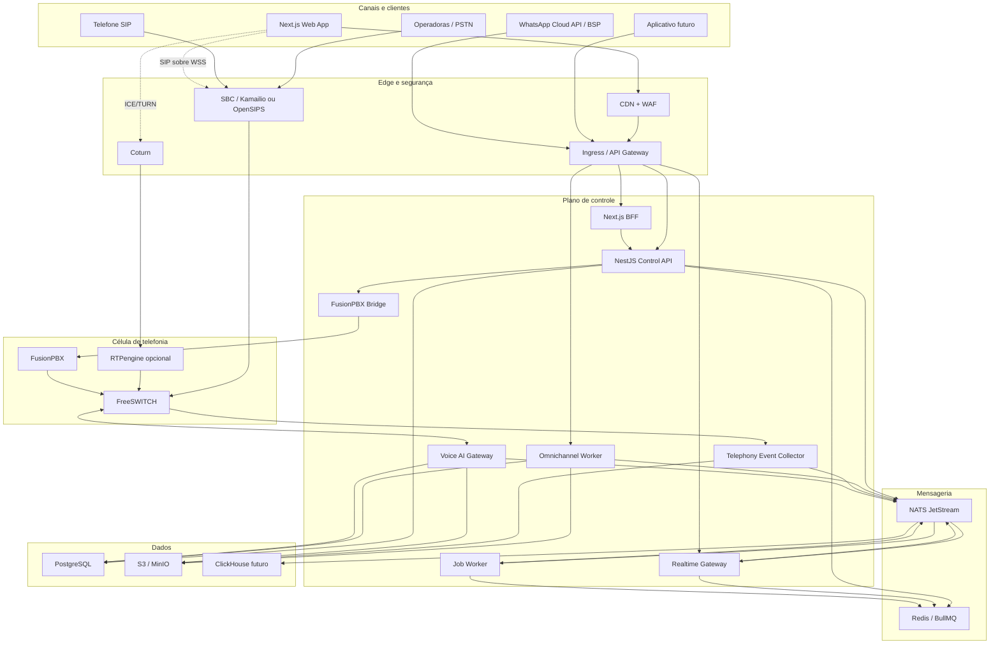
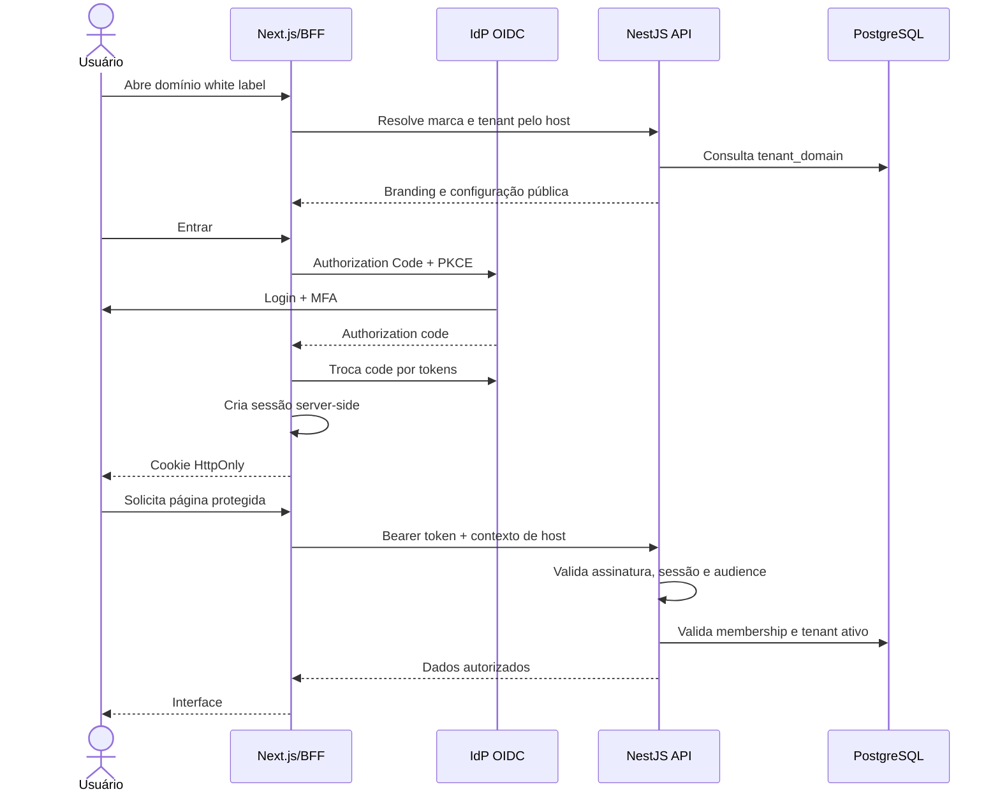
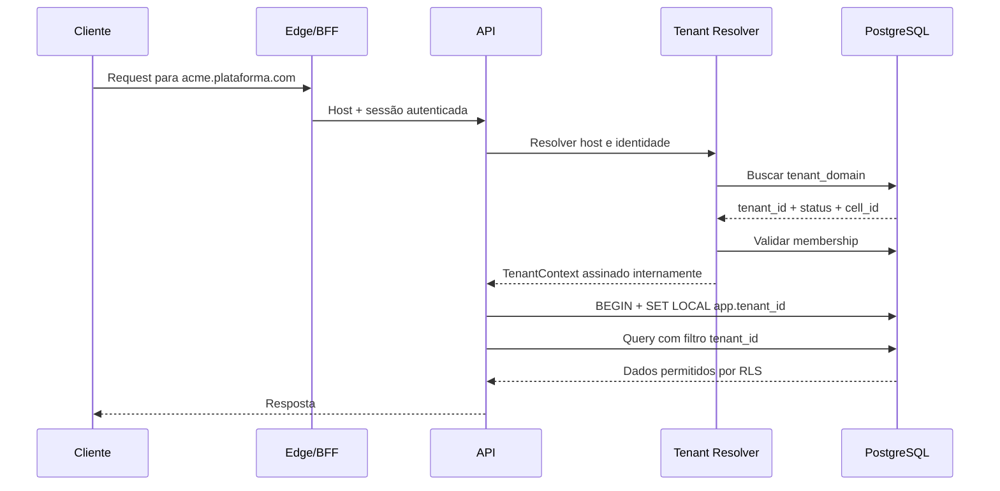
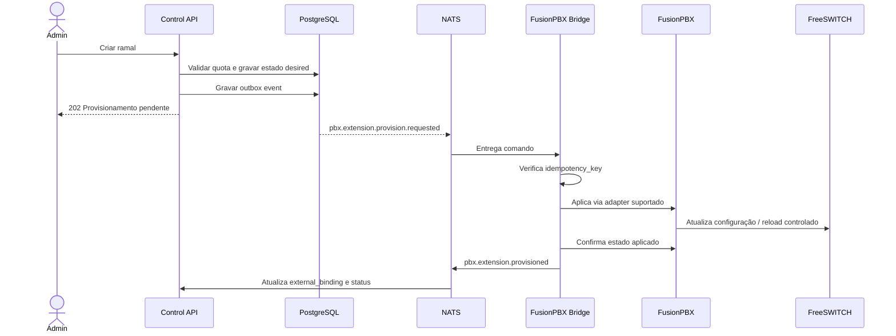
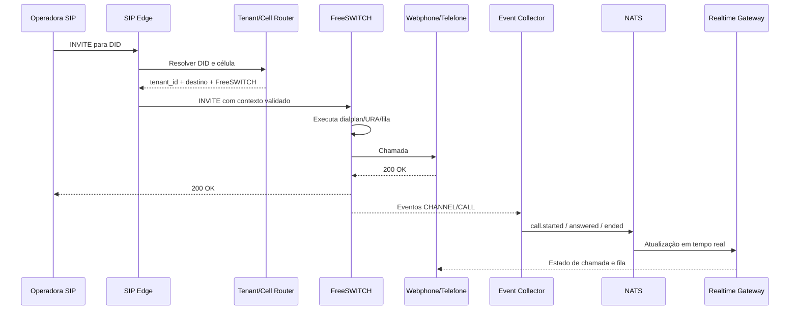
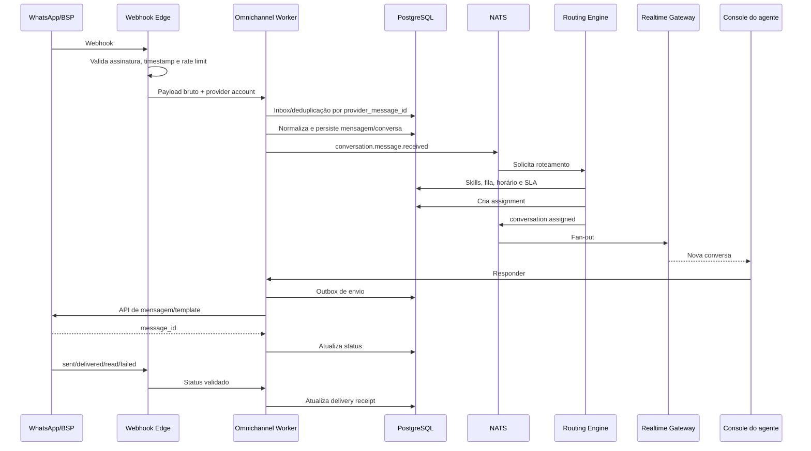
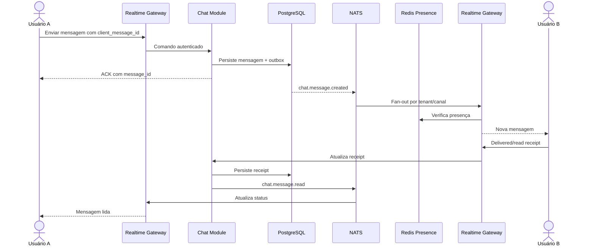
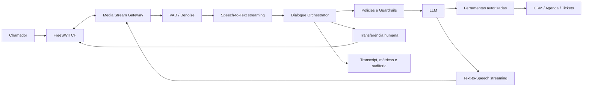
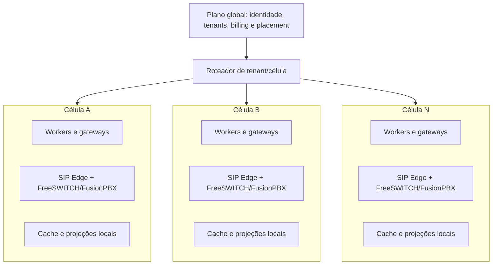

# Arquitetura Mestra - Plataforma UCaaS + CCaaS White Label

## 1. Resumo executivo

Esta arquitetura descreve a evolução do protótipo atual para uma plataforma SaaS
multi-tenant de Comunicação Unificada, Contact Center e Omnichannel baseada em
FusionPBX e FreeSWITCH.

A recomendação é não iniciar com dezenas de microsserviços. O produto deve
nascer com:

- um **monólito modular NestJS** para o plano de controle;
- serviços separados para cargas com perfil operacional próprio;
- integração assíncrona e desacoplada com FusionPBX/FreeSWITCH;
- PostgreSQL como banco transacional principal;
- Redis para cache, presença, locks e filas de curta duração;
- NATS JetStream como barramento durável de eventos;
- armazenamento S3 compatível para gravações, mídias e anexos;
- Kubernetes como plataforma de execução;
- arquitetura celular para escalar telefonia e omnichannel.

Os processos separados desde o início devem ser:

1. `web`: aplicação Next.js e BFF.
2. `control-api`: API NestJS e módulos de negócio.
3. `realtime-gateway`: WebSocket, presença e eventos para a interface.
4. `fusionpbx-bridge`: provisionamento e reconciliação com FusionPBX.
5. `telephony-event-collector`: coleta de eventos do FreeSWITCH.
6. `omnichannel-worker`: webhooks, roteamento e envio de mensagens.
7. `voice-ai-gateway`: streaming de áudio e orquestração da IA de voz.
8. `job-worker`: tarefas assíncronas, exportações e notificações.

Esse desenho preserva velocidade de desenvolvimento no início e permite extrair
novos microsserviços quando volume, equipe ou isolamento operacional
justificarem a separação.

## 2. Premissas de capacidade

A arquitetura deve ser validada por testes de carga, pois a quantidade de
empresas não determina sozinha o consumo de telefonia.

Premissas iniciais para planejamento:

| Dimensão | Meta de projeto |
| --- | ---: |
| Empresas cadastradas | 1.000 |
| Usuários provisionados | 50.000 |
| Sessões web simultâneas | 10.000 |
| Conexões WebSocket simultâneas | 10.000 |
| Chamadas simultâneas | 2.000 |
| Agentes de contact center simultâneos | 3.000 |
| Mensagens omnichannel por dia | 1.000.000 |
| Retenção de CDR online | 24 meses |
| Disponibilidade do plano de controle | 99,9% |
| Disponibilidade de telefonia contratável | 99,95% por célula |
| RPO do banco transacional | até 5 minutos |
| RTO inicial | até 60 minutos |

Uma empresa com 500 chamadas simultâneas pode consumir mais recursos do que
centenas de pequenas empresas. O placement de tenants deve considerar canais,
transcodificação, gravação, IA e taxa de mensagens, não apenas quantidade de
clientes.

## 3. Estado atual e direção de evolução

O repositório atual é um protótipo React/Vite com Ant Design, dados mockados,
sessão no navegador e telas para os principais domínios.

Ele já serve como referência funcional para:

- gestão de empresas;
- usuários e perfis;
- extensões, troncos e rotas;
- filas, URA e grupos;
- webphone;
- contact center;
- relatórios e gravações;
- chat;
- WhatsApp;
- segurança e configurações.

Antes de produção, os seguintes pontos devem ser substituídos:

| Estado atual | Arquitetura alvo |
| --- | --- |
| Identidade de usuário em `localStorage` | OIDC, sessão segura e cookie `HttpOnly` |
| `X-Tenant-ID` fixo no navegador | Tenant derivado e validado no servidor |
| Permissões calculadas apenas no React | Policies e guards obrigatórios no backend |
| Dados de tenant no navegador | PostgreSQL com isolamento por tenant |
| Credenciais WhatsApp enviadas pelo frontend | Secrets criptografados e manipulados apenas no backend |
| Integrações diretas por página | Adaptadores de provider e workers assíncronos |
| Mocks locais | Contratos OpenAPI, API real e fixtures de teste |
| Vite/React Router | Next.js App Router |
| Componentes Ant Design | Tailwind e ShadCN, por migração gradual |

O protótipo não deve ser descartado. As páginas podem ser migradas por domínio
para o novo `apps/web`, preservando regras visuais e fluxos já validados.

## 4. Princípios arquiteturais

1. **Tenant sempre explícito no servidor**: toda operação de negócio possui
   `tenant_id` validado.
2. **Zero confiança no cliente**: headers, roles, limites e IDs enviados pelo
   browser são apenas entrada não confiável.
3. **Plano de controle separado do plano de mídia**: falhas no dashboard não
   devem derrubar chamadas em curso.
4. **Estado desejado e reconciliação**: alterações de PABX são comandos
   idempotentes, acompanhados até convergirem no FusionPBX.
5. **Eventos duráveis**: fatos de negócio importantes usam outbox/inbox e
   barramento durável.
6. **Redis não é banco mestre**: dados críticos permanecem no PostgreSQL ou no
   armazenamento de objetos.
7. **APIs primeiro**: REST/OpenAPI para comandos e consultas; WebSocket para
   atualizações em tempo real.
8. **Observabilidade por padrão**: toda requisição, comando e evento leva
   `correlation_id`, `tenant_id` e contexto de auditoria.
9. **Isolamento progressivo**: schema compartilhado no início, células e bancos
   dedicados para clientes de grande porte quando necessário.
10. **Extração orientada por necessidade**: um módulo vira microsserviço por
    escala, criticidade, segurança ou autonomia de equipe, não por moda.

## 5. Visão geral da arquitetura

### 5.1 Camadas

**Experiência**

- Next.js, React, TypeScript, Tailwind e ShadCN.
- Aplicação responsiva com shell inspirado em Teams, Zoom Phone e RingCentral.
- Design tokens por marca para white label.
- BFF no Next.js para sessão web e agregação de dados.

**Edge**

- CDN e WAF.
- Ingress Controller ou API Gateway.
- TLS, rate limiting, proteção de webhooks e resolução de domínio.
- SBC/SIP Proxy dedicado para sinalização de telefonia.

**Plano de controle**

- API NestJS modular.
- Gestão de tenants, usuários, planos, CRM, configurações, relatórios e
  orquestração.
- PostgreSQL, Redis, workers e barramento de eventos.

**Tempo real**

- Gateway WebSocket.
- Presença, typing, estado de agentes, métricas de fila e notificações.
- Redis para estado efêmero e NATS para fan-out entre réplicas.

**Comunicações**

- FusionPBX para gestão e configuração do domínio de telefonia.
- FreeSWITCH para execução de chamadas, filas, conferências e mídia.
- Kamailio ou OpenSIPS como SIP edge.
- RTPengine quando houver necessidade de ancoragem e distribuição de mídia.
- Coturn para conectividade WebRTC.

**Dados**

- PostgreSQL para OLTP.
- Réplicas de leitura e particionamento para CDR.
- S3/MinIO para gravações, anexos e exportações.
- ClickHouse em fase de escala para analytics de alto volume.

**Plataforma**

- Docker, Kubernetes, Helm e GitHub Actions.
- Terraform para infraestrutura.
- OpenTelemetry, Prometheus, Grafana, Loki e Tempo.
- External Secrets com Vault ou secret manager do provedor.

### 5.2 Arquitetura visual e experiência

O frontend deve usar um shell consistente, orientado a tarefas:

- rail lateral para módulos principais;
- barra superior com busca, presença, notificações e tenant ativo;
- workspace central para listas, dashboards e atendimento;
- painel contextual à direita para contato, chamada, CRM e histórico;
- desktop unificado do agente para voz, WhatsApp e chat;
- command palette para navegação e ações rápidas;
- densidade configurável para operação de call center;
- dark mode;
- responsividade para supervisão e tarefas administrativas;
- acessibilidade WCAG 2.2 AA como meta.

Os componentes não devem carregar cores fixas de uma marca. O pacote `ui`
expõe design tokens semânticos:

```text
--brand-primary
--brand-secondary
--surface
--surface-elevated
--text-primary
--text-muted
--status-success
--status-warning
--status-danger
```

Padrões inspirados nas referências:

- Teams: navegação persistente, presença e colaboração;
- Zoom Phone: foco em chamadas e dispositivo;
- RingCentral: workspace unificado de comunicação;
- Aircall: operação simples para agente e supervisor;
- Salesforce: contexto do cliente, timeline e extensibilidade.

O objetivo não é copiar interfaces, mas combinar os padrões que reduzem troca
de contexto durante o atendimento.

## 6. Diagrama de componentes



## 7. Arquitetura de módulos

### 7.1 Módulos do plano de controle

| Módulo | Responsabilidade | Entidades principais |
| --- | --- | --- |
| Identity | Login, MFA, sessões, recuperação e federação | identity, session, credential |
| Tenancy | Empresas, domínios, marca e placement | tenant, tenant_domain, brand, cell |
| Membership | Vínculo usuário-empresa e convites | user, membership, invitation |
| Authorization | RBAC, scopes, policies e delegação | role, permission, policy |
| Subscription | Planos, recursos, limites e consumo | plan, subscription, quota, usage |
| Billing | Cobrança, faturas e integrações financeiras | invoice, charge, payment |
| PBX Inventory | Modelo desejado de ramais, troncos e rotas | extension, trunk, route, ivr |
| PBX Provisioning | Comandos, jobs, reconciliação e drift | command, sync_job, external_binding |
| Call Center | Filas, agentes, pausas, SLA e campanhas | queue, agent, skill, campaign |
| Telephony | Sessões, chamadas, CDR e gravações | call, call_leg, cdr, recording |
| Webphone | Credenciais efêmeras e estado do dispositivo | device, registration, webphone_token |
| Contacts | Agenda e identidade de contatos | contact, contact_channel, tag |
| CRM | Empresas, negócios, atividades e timeline | account, lead, deal, activity |
| Chat | Canais internos, mensagens e leitura | channel, message, receipt |
| Omnichannel | Conversas, inbox, roteamento e providers | conversation, message, assignment |
| WhatsApp | WABA, números, templates e webhooks | wa_account, wa_number, template |
| Voice AI | Agentes, prompts, ferramentas e avaliações | ai_agent, prompt_version, tool, run |
| Reporting | Consultas, exports e indicadores | report, export_job, metric |
| Notifications | E-mail, push, in-app e webhooks de saída | notification, endpoint, delivery |
| Audit | Trilha imutável de ações e acessos | audit_event, access_event |
| Integrations | Credenciais, adapters e health checks | integration, secret_ref, webhook |
| Support | Impersonação controlada e diagnóstico | support_session, diagnostic |

### 7.2 Limites recomendados

- Um módulo não acessa diretamente as tabelas internas de outro módulo.
- Comunicação síncrona interna ocorre por serviços públicos do módulo.
- Efeitos colaterais entre módulos usam eventos.
- Contratos de eventos ficam versionados em `packages/contracts`.
- Integrações externas ficam atrás de interfaces e adapters.
- Nenhuma página do frontend conhece detalhes de FusionPBX, Meta ou operadora.

### 7.3 Serviços separados desde o início

| Serviço | Motivo da separação |
| --- | --- |
| Realtime Gateway | Muitas conexões longas e escala por conexões |
| FusionPBX Bridge | Acesso restrito às redes de telefonia |
| Telephony Event Collector | Alto volume e necessidade de backpressure |
| Omnichannel Worker | Webhooks públicos e limites dos providers |
| Voice AI Gateway | Streaming, GPU/provider e latência baixa |
| Job Worker | Tarefas lentas sem bloquear requests |

## 8. Arquitetura de dados

### 8.1 Estratégia multi-tenant

O padrão inicial é **banco compartilhado e schema compartilhado**, com
`tenant_id` obrigatório nas tabelas de negócio.

Controles mínimos:

- `tenant_id` em chaves, índices e constraints;
- consultas sempre filtradas pelo contexto de tenant;
- Row-Level Security nas tabelas sensíveis;
- testes automáticos de isolamento;
- usuário de banco da aplicação sem permissão para ignorar RLS;
- jobs e eventos carregando `tenant_id`;
- chaves Redis prefixadas por ambiente e tenant;
- objetos S3 separados por prefixo de tenant;
- limites e rate limits por tenant.

Exemplos de constraints:

```sql
UNIQUE (tenant_id, extension_number)
UNIQUE (tenant_id, contact_channel_type, contact_channel_value)
UNIQUE (tenant_id, provider, provider_message_id)
```

IDs externos devem usar UUIDv7 ou ULID. IDs sequenciais internos não devem ser
expostos como identificadores públicos.

### 8.2 Tabelas globais e locais

**Globais**

- `users`;
- `tenants`;
- `tenant_domains`;
- `plans`;
- `regions`;
- `cells`;
- `identity_providers`.

**Escopadas por tenant**

- `memberships`;
- `roles` e `role_bindings`;
- `contacts`;
- `extensions`;
- `queues`;
- `conversations`;
- `messages`;
- `calls`;
- `recordings`;
- `audit_events`;
- `integration_accounts`.

Um usuário pode participar de múltiplas empresas. A autorização é calculada
pela combinação:

```text
user + membership + active_tenant + role_bindings + resource policy
```

### 8.3 Evolução de armazenamento

| Fase | Estratégia |
| --- | --- |
| MVP | PostgreSQL único com HA, RLS, índices e particionamento mensal de CDR |
| Comercial | Réplica de leitura, PgBouncer e banco de jobs separado logicamente |
| Escala | ClickHouse para analytics e CDR analítico |
| Enterprise | Banco ou cluster dedicado para tenants regulados ou muito grandes |

### 8.4 Outbox e idempotência

Operações que alteram dados e publicam eventos devem usar Transactional Outbox:

1. a transação grava o estado e o registro em `outbox_events`;
2. o publisher envia o evento ao NATS;
3. o consumidor registra a mensagem em `inbox_messages`;
4. duplicatas são descartadas pela chave de idempotência;
5. falhas repetidas seguem para uma dead-letter stream.

Isso é obrigatório para provisionamento, mensagens, faturamento, gravações,
exportações e automações.

## 9. Estrutura de pastas

Monorepo recomendado com `pnpm` e Turborepo:

```text
/
|-- apps/
|   |-- web/                       # Next.js App Router + BFF
|   |-- control-api/               # NestJS modular monolith
|   |-- realtime-gateway/          # WebSocket e presença
|   |-- job-worker/                # BullMQ e tarefas agendadas
|   |-- omnichannel-worker/        # WhatsApp e canais futuros
|   |-- fusionpbx-bridge/          # Adapter e reconciliador FusionPBX
|   |-- telephony-event-collector/ # ESL, CDR e eventos FreeSWITCH
|   `-- voice-ai-gateway/           # Streaming de áudio e IA
|-- packages/
|   |-- ui/                        # ShadCN, tokens e componentes
|   |-- contracts/                 # DTOs, schemas e eventos versionados
|   |-- auth/                      # Helpers OIDC e policies
|   |-- database/                  # Prisma, migrations e seeds
|   |-- observability/             # OpenTelemetry e logging
|   |-- config/                    # Configuração validada
|   |-- testing/                   # Fixtures e test containers
|   `-- eslint-config/
|-- infra/
|   |-- docker/
|   |-- helm/
|   |-- kubernetes/
|   |-- terraform/
|   |-- github-actions/
|   `-- runbooks/
|-- docs/
|   |-- architecture/
|   |-- adr/
|   |-- api/
|   |-- security/
|   `-- operations/
|-- tests/
|   |-- e2e/
|   |-- contract/
|   |-- load/
|   `-- security/
|-- pnpm-workspace.yaml
|-- turbo.json
`-- package.json
```

Estrutura interna de um módulo NestJS:

```text
src/modules/tenancy/
|-- application/
|   |-- commands/
|   |-- queries/
|   `-- services/
|-- domain/
|   |-- entities/
|   |-- events/
|   |-- policies/
|   `-- repositories/
|-- infrastructure/
|   |-- persistence/
|   |-- messaging/
|   `-- providers/
|-- presentation/
|   |-- http/
|   `-- consumers/
`-- tenancy.module.ts
```

Essa separação deve ser usada nos módulos complexos. Módulos CRUD pequenos
podem começar com uma estrutura mais simples.

## 10. Fluxo de autenticação

### 10.1 Decisão

Usar OpenID Connect com Authorization Code + PKCE. Keycloak pode ser o IdP
self-hosted inicial, mantendo compatibilidade futura com Entra ID, Google
Workspace, Okta ou um provedor gerenciado.

Para a aplicação web, adotar BFF:

- access e refresh tokens não ficam em `localStorage`;
- o navegador recebe apenas cookie de sessão `Secure`, `HttpOnly` e
  `SameSite=Lax`;
- o BFF anexa o access token ao chamar a API;
- mutações usam proteção CSRF;
- conexões WebSocket recebem token efêmero de uso único.

### 10.2 Sequência



### 10.3 Regras

- Access token entre 5 e 15 minutos.
- Refresh token com rotação e detecção de reutilização.
- MFA obrigatório para administradores.
- Reautenticação para ações sensíveis.
- Bloqueio progressivo e proteção contra credential stuffing.
- Revogação de sessão por usuário, tenant e plataforma.
- SSO SAML/OIDC no plano Enterprise.
- SCIM em fase Enterprise.
- Conta de suporte não recebe acesso automático aos dados do tenant.

### 10.4 Matriz RBAC inicial

| Perfil | Escopo | Capacidades principais |
| --- | --- | --- |
| Platform Super Admin | Plataforma | tenants, planos, células e operação global |
| Platform Support | Plataforma limitada | diagnóstico; acesso a conteúdo somente via sessão aprovada |
| Tenant Owner | Tenant | contrato, admins, billing e todas as configurações |
| Tenant Admin | Tenant | usuários, PABX, integrações e políticas |
| Supervisor | Filas/equipes | agentes, filas, monitoria, relatórios e qualidade |
| Agent | Atendimento | chamadas, inbox, contatos e CRM permitido |
| User | Usuário final | webphone, chat, voicemail e agenda |
| Auditor | Tenant read-only | auditoria, relatórios e evidências autorizadas |
| Billing Admin | Tenant financeiro | plano, consumo, faturas e métodos de pagamento |

RBAC é a base, mas ações sensíveis também usam atributos:

- tenant ativo;
- ownership do recurso;
- equipe ou fila;
- classificação do dado;
- horário e localização;
- estado da sessão;
- aprovação just-in-time;
- limites do plano.

Exemplo: a role Supervisor pode ouvir gravações apenas das filas sob sua
responsabilidade e somente quando a política de gravação do tenant permitir.

## 11. Fluxo multi-tenant

### 11.1 Resolução

O tenant pode ser identificado por:

1. domínio customizado verificado;
2. subdomínio da plataforma;
3. tenant ativo salvo na sessão para usuários multiempresa.

O browser não pode escolher livremente o tenant por `X-Tenant-ID`.



### 11.2 Contexto obrigatório

Cada request e mensagem interna deve conter:

```ts
type TenantContext = {
  tenantId: string;
  membershipId: string;
  userId: string;
  roles: string[];
  cellId: string;
  correlationId: string;
};
```

O contexto é criado após autenticação e não diretamente a partir de campos
enviados pelo usuário.

### 11.3 White label

- `tenant_domains` armazena domínio, status DNS e certificado.
- `tenant_branding` armazena logo, cores, favicon, nome e textos.
- Tokens visuais são transformados em CSS variables.
- E-mail e notificações usam templates versionados por tenant.
- Certificados são emitidos e renovados com cert-manager.
- Domínios customizados exigem verificação DNS antes da ativação.

## 12. Fluxo de telefonia

### 12.1 Responsabilidades

**SaaS**

- estado desejado de configuração;
- catálogo de extensões, filas e rotas;
- permissões, planos e limites;
- comandos de provisionamento;
- experiência do usuário e relatórios.

**FusionPBX**

- representação operacional do domínio de PABX;
- configuração aplicada ao FreeSWITCH;
- recursos nativos de dialplan e administração.

**FreeSWITCH**

- sinalização e mídia;
- execução de dialplan;
- filas, conferências e gravação;
- geração de eventos de chamada.

**SIP Edge**

- proteção da borda;
- roteamento para a célula correta;
- rate limit SIP;
- topologia e políticas antifraude.

### 12.2 Provisionamento



O bridge deve preferir APIs suportadas pelo FusionPBX. Quando a implantação
controlada exigir uma extensão própria, ela deve encapsular a camada de
aplicação do FusionPBX. Escritas genéricas e espalhadas diretamente no banco do
FusionPBX não são permitidas.

Um reconciliador periódico compara:

- estado desejado no SaaS;
- estado aplicado no FusionPBX;
- estado observado no FreeSWITCH.

Drift gera alerta e, conforme política, correção automática.

### 12.3 Chamada de entrada



### 12.4 WebPhone WebRTC

- SIP.js ou biblioteca equivalente no navegador.
- SIP sobre WSS até o SIP Edge.
- DTLS-SRTP para mídia.
- ICE com STUN e Coturn.
- Credenciais temporárias ou escopo reduzido.
- Sem senha permanente do ramal armazenada no browser.
- Device binding e revogação por sessão.
- Política de codecs para reduzir transcodificação.
- Teste de microfone, jitter, perda e latência antes da chamada.

FreeSWITCH é stateful durante a chamada. Escala não deve depender de HPA
arbitrário. Novas chamadas são direcionadas a nós saudáveis, enquanto nós em
manutenção entram em drain até finalizar as sessões existentes.

## 13. Fluxo WhatsApp Omnichannel

O provider preferencial é a WhatsApp Cloud API oficial. Um adapter permite
usar BSPs como Twilio sem contaminar o domínio interno.

Modelo canônico:

```text
Provider webhook -> mensagem normalizada -> conversa -> fila -> atribuição
-> agente -> outbox -> provider -> status de entrega
```



Requisitos:

- idempotência por ID do provider;
- preservação opcional do payload bruto para auditoria;
- download assíncrono de mídia para S3;
- antivírus em anexos;
- políticas para janela de atendimento e templates;
- retry com exponential backoff e jitter;
- circuit breaker por provider;
- quotas por tenant e número;
- segregação de credenciais por tenant;
- trilha de opt-in e opt-out;
- suporte futuro a Instagram, Messenger, SMS e e-mail no mesmo modelo.

## 14. Fluxo de chat corporativo



Decisões:

- PostgreSQL guarda mensagens e recibos.
- Redis guarda presença, typing e conexões.
- NATS distribui eventos entre gateways.
- S3 guarda anexos com URLs assinadas.
- Ordenação é garantida por canal usando sequência lógica.
- `client_message_id` evita duplicação após reconexão.
- Busca textual pode iniciar com PostgreSQL e migrar para OpenSearch.
- Retenção, exportação e legal hold são políticas por tenant.

## 15. Fluxo de IA de Voz

### 15.1 Pipeline



### 15.2 Regras técnicas

- streaming bidirecional de áudio;
- VAD e interrupção do agente por fala do usuário;
- STT, LLM e TTS atrás de adapters de provider;
- orçamento de latência por etapa;
- ferramentas com schema, allowlist e autorização por tenant;
- prompts versionados e imutáveis após publicação;
- dados sensíveis removidos antes de logs e avaliações;
- consentimento de gravação conforme contexto jurídico;
- limite de custo por chamada e por tenant;
- fallback para URA ou agente humano;
- circuit breaker quando um provider de IA falhar;
- testes contra prompt injection e tool abuse;
- avaliação offline antes de promover uma nova versão.

### 15.3 Meta de latência

| Etapa | Meta inicial p95 |
| --- | ---: |
| Detecção de fim de fala | 200-400 ms |
| STT parcial | abaixo de 400 ms |
| Primeira resposta do modelo | abaixo de 700 ms |
| Primeiro áudio TTS | abaixo de 350 ms |
| Latência percebida total | 1,2-2,0 s |

Chamadas com IA devem poder ser posicionadas em células específicas para
controlar custo, largura de banda e conformidade.

## 16. Dashboard executivo e relatórios

### 16.1 Separação entre operacional e analítico

**Operacional**

- estado de agentes;
- chamadas em espera;
- SLA atual;
- conversas aguardando;
- incidentes e integrações.

Esses dados vêm de eventos, Redis e projeções de leitura.

**Analítico**

- CDR;
- desempenho histórico;
- custos;
- qualidade;
- produtividade;
- funil CRM;
- comparativos por período.

No MVP, PostgreSQL particionado e réplicas atendem relatórios. Em escala,
eventos são projetados no ClickHouse para evitar consultas pesadas no OLTP.

### 16.2 Regras

- exports sempre assíncronos;
- filtros incluem tenant e timezone;
- métricas possuem definição versionada;
- dashboards consultam read models, nunca tabelas operacionais complexas;
- gravações são acessadas por URL assinada de curta duração;
- relatórios sensíveis exigem permissão e geram auditoria.

## 17. Estratégia de escalabilidade

### 17.1 Escala horizontal

| Componente | Unidade de escala | Sinal |
| --- | --- | --- |
| Next.js | pods | CPU, RPS e latência |
| Control API | pods | CPU, RPS e p95 |
| Realtime Gateway | pods | conexões e mensagens/s |
| Job Worker | pods | profundidade e idade da fila |
| Omnichannel Worker | pods | webhooks/s e backlog |
| Event Collector | pods por célula | eventos/s e lag |
| Voice AI Gateway | pods | sessões de áudio e GPU |
| PostgreSQL | vertical + réplicas | CPU, IOPS, locks e conexões |
| Redis | cluster/replicas | memória, ops/s e evictions |
| NATS | cluster | throughput, storage e consumer lag |
| FreeSWITCH | nós por célula | canais, CPU, CPS e codecs |

Kubernetes HPA cuida de workloads stateless. KEDA pode escalar consumidores por
lag. Telefonia e streams de áudio exigem métricas customizadas e drain.

### 17.2 Arquitetura celular

Uma célula limita blast radius e noisy neighbor.



Plano inicial:

- uma célula para desenvolvimento;
- uma célula redundante para os primeiros clientes;
- novas células ao atingir limite de canais, eventos ou risco;
- referência de 100 a 250 tenants por célula, ajustada pelo perfil;
- tenant Enterprise pode receber célula dedicada;
- `cell_id`, `region_id` e `telephony_cluster_id` ficam no cadastro do tenant.

### 17.3 Banco e conexões

- PgBouncer entre aplicações e PostgreSQL.
- Pool pequeno por pod.
- Réplica para relatórios e exports.
- Particionamento temporal de CDR e audit.
- Índices sempre iniciando por `tenant_id` nas consultas escopadas.
- Arquivamento de partições antigas em object storage.
- Limite de query e cancelamento de relatórios caros.
- Migrações expand/contract sem downtime.

### 17.4 Controles de noisy neighbor

- quotas de canais simultâneos;
- rate limits por API, usuário e tenant;
- limites de mensagens e templates;
- filas separadas por prioridade;
- fair scheduling nos workers;
- limites de exportação;
- circuit breakers por integração;
- orçamento de IA por tenant;
- storage quota e retenção configurável.

## 18. Estratégia de segurança

### 18.1 Principais ameaças

1. Vazamento entre tenants.
2. Sequestro de conta administrativa.
3. Fraude telefônica e chamadas internacionais indevidas.
4. Exposição de gravações e transcrições.
5. Falsificação de webhook.
6. Vazamento de tokens de WhatsApp, SIP ou IA.
7. Abuso de ferramentas por IA.
8. Ataques de negação de serviço em HTTP, SIP e WebSocket.

### 18.2 Controles por camada

**Identidade**

- OIDC, MFA e passkeys quando suportadas;
- políticas de sessão e device trust;
- SSO Enterprise;
- rotação e revogação de refresh token;
- MFA obrigatório para suporte e plataforma.

**Autorização**

- RBAC com policies contextuais;
- deny by default;
- autorização em cada endpoint e consumer;
- escopo por tenant e recurso;
- suporte com acesso just-in-time, motivo e auditoria;
- teste automatizado de matriz de permissões.

**Aplicação**

- validação por schema;
- CSRF, CSP, HSTS e cookies seguros;
- proteção SSRF para URLs e webhooks;
- idempotência em mutações críticas;
- rate limiting e bot protection;
- dependências e imagens assinadas e verificadas.

**Dados**

- TLS em trânsito;
- criptografia em repouso;
- secrets por referência, nunca em tabela em texto claro;
- envelope encryption para credenciais de provider;
- URLs assinadas para mídia;
- mascaramento de PII em logs;
- backup com PITR e testes de restauração.

**Telefonia**

- Event Socket acessível apenas por rede privada;
- ACL de operadoras e peers;
- autenticação forte de trunks;
- limites de CPS e canais;
- bloqueio geográfico e por prefixo;
- orçamento diário de chamadas;
- detecção de anomalias;
- gravações em object storage, não em disco local permanente;
- sinalização TLS e SRTP quando suportados.

**Infraestrutura**

- namespaces por ambiente, não por tenant;
- NetworkPolicies;
- Pod Security Standards;
- imagens sem root e filesystem read-only quando possível;
- secret manager externo;
- mTLS ou workload identity entre serviços críticos;
- WAF, DDoS protection e egress control;
- SBOM, SAST, DAST e scan de containers no CI.

### 18.3 LGPD e governança

- inventário de dados pessoais;
- base legal e consentimento quando aplicável;
- retenção por categoria;
- exclusão e anonimização;
- legal hold;
- exportação de dados do titular;
- registro de acesso a gravações;
- região de armazenamento configurável;
- contratos com subprocessadores;
- procedimento de incidente e comunicação.

## 19. Observabilidade e confiabilidade

### 19.1 Telemetria

- OpenTelemetry em todos os serviços;
- traces distribuídos entre HTTP, NATS e jobs;
- métricas Prometheus;
- logs estruturados;
- dashboards Grafana;
- alertas por SLO e burn rate.

Campos mínimos:

```text
timestamp
level
service
environment
tenant_id
user_id
correlation_id
trace_id
operation
resource_id
result
duration_ms
```

Conteúdo de mensagens, áudio, tokens e senhas não deve aparecer em logs.

### 19.2 Sinais essenciais

- login e falhas de MFA;
- RPS, erros e latência da API;
- conexões WebSocket;
- consumer lag;
- jobs atrasados;
- webhook failure rate;
- chamadas simultâneas e CPS;
- ASR, ACD e PDD;
- jitter, packet loss e MOS estimado;
- filas e agentes;
- uso de canais por tenant;
- custo e latência de IA;
- replicação e espaço de banco;
- falhas de backup e restore.

### 19.3 Resiliência

- timeouts explícitos;
- retries somente em operações idempotentes;
- exponential backoff com jitter;
- circuit breakers;
- bulkheads por provider;
- dead-letter queues;
- readiness e liveness probes;
- graceful shutdown;
- chaos tests em componentes críticos;
- runbooks para incidentes de SIP, banco, Redis, NATS e provider.

## 20. CI/CD e Kubernetes

### 20.1 Pipeline GitHub Actions

Pull request:

1. lint e formatação;
2. typecheck;
3. testes unitários;
4. testes de integração com containers;
5. testes de contrato;
6. build;
7. SAST, secret scan e dependency scan;
8. preview do frontend quando aplicável.

Branch principal:

1. build de imagens imutáveis;
2. geração de SBOM;
3. assinatura das imagens;
4. push para registry;
5. deploy automático em staging;
6. smoke e e2e;
7. aprovação para produção;
8. rollout canary ou blue/green;
9. verificação automática de métricas;
10. rollback se os critérios falharem.

### 20.2 Kubernetes

- `dev`, `staging` e `prod` separados;
- Helm charts por aplicação;
- Argo CD recomendado para GitOps;
- HPA para workloads stateless;
- KEDA para consumers;
- PodDisruptionBudget;
- anti-affinity entre zonas;
- topology spread constraints;
- persistent volumes somente onde inevitável;
- bancos, object storage e secret manager preferencialmente gerenciados;
- FreeSWITCH e FusionPBX implantados em pools/células com operação específica.

Migrações de banco são jobs versionados e compatíveis com a versão anterior da
aplicação durante o rollout.

## 21. Roadmap por fases

Os prazos dependem da equipe. As durações abaixo são faixas para planejamento,
não compromisso comercial.

### Fase 0 - Fundação e arquitetura (3-5 semanas)

Entregas:

- monorepo;
- Next.js, NestJS e biblioteca de UI;
- PostgreSQL, Redis e NATS locais por Docker Compose;
- OIDC e BFF;
- modelo de tenancy e RBAC;
- observabilidade base;
- CI de pull request;
- contratos OpenAPI;
- ADRs;
- threat model;
- ambientes dev e staging.

Critério de saída:

- login seguro;
- tenant resolvido no servidor;
- endpoint protegido com RLS;
- deploy reproduzível;
- teste automatizado provando isolamento entre dois tenants.

### Fase 1 - MVP mínimo de telefonia (8-12 semanas)

Entregas:

- empresas, usuários e convites;
- roles básicas;
- planos e limites manuais;
- extensões;
- troncos SIP;
- rotas de entrada e saída;
- URA;
- grupos e filas básicas;
- bridge FusionPBX;
- reconciliação;
- webphone WebRTC;
- CDR e gravações;
- dashboard operacional básico;
- auditoria administrativa.

Critério de saída:

- 3 a 10 tenants piloto;
- criação de tenant e PABX sem operação manual no banco;
- chamadas internas, entrada e saída;
- recuperação de falha de provisionamento;
- backup e restore testados.

### Fase 2 - MVP comercial (8-12 semanas)

Entregas:

- onboarding automatizado;
- white label;
- quotas e medição;
- billing;
- painel de suporte;
- relatórios e exports;
- wallboard;
- supervisão de agentes;
- monitoramento de qualidade;
- notificações;
- SLA, status page e runbooks;
- antifraude inicial;
- hardening e pentest.

Critério de saída:

- 50 a 100 tenants;
- cobrança e bloqueios de quota confiáveis;
- operação N1/N2 documentada;
- SLOs medidos;
- rollout e rollback sem indisponibilidade relevante.

### Fase 3 - CCaaS e Omnichannel (10-14 semanas)

Entregas:

- inbox omnichannel;
- WhatsApp Cloud API;
- templates;
- skills e roteamento;
- estados e pausas de agente;
- SLA de conversas;
- chat corporativo;
- CRM básico;
- timeline unificada;
- campanhas e callbacks;
- qualidade e avaliação de atendimento.

Critério de saída:

- uma identidade de contato entre voz e WhatsApp;
- mensagens idempotentes;
- handoff e reatribuição;
- relatórios unificados;
- operação tolerante a indisponibilidade temporária do provider.

### Fase 4 - IA de Voz e dados (12-16 semanas)

Entregas:

- media stream gateway;
- adapters STT, LLM e TTS;
- agentes de IA versionados;
- ferramentas seguras;
- handoff humano;
- transcrição e resumo;
- avaliação de qualidade;
- controles de custo;
- ClickHouse;
- dashboards executivos avançados.

Critério de saída:

- latência dentro do SLO;
- fallback testado;
- avaliação antes de publicar prompts;
- custo rastreado por chamada e tenant;
- PII protegida.

### Fase 5 - Escala e Enterprise (contínua)

Entregas:

- múltiplas células e regiões;
- tenant placement;
- SSO/SAML e SCIM;
- BYOC;
- banco/célula dedicada;
- DR regional;
- políticas avançadas;
- auditoria exportável;
- marketplace de integrações;
- APIs e webhooks públicos;
- certificações e processos de compliance.

Critério de saída:

- testes para 1.000 tenants;
- failover por célula;
- recuperação regional exercitada;
- isolamento de clientes de alto consumo;
- capacidade e custo conhecidos por unidade de uso.

## 22. MVP mínimo para lançamento

O MVP mínimo é um piloto controlado, não a versão comercial ampla.

Escopo obrigatório:

- cadastro de empresa;
- domínio/subdomínio;
- usuários, convite e reset de acesso;
- Admin, Supervisor, Agente e Usuário;
- MFA para administradores;
- ramais;
- troncos SIP;
- rotas de entrada e saída;
- URA;
- grupos de toque;
- fila básica;
- webphone;
- CDR;
- gravações com controle de acesso;
- dashboard básico;
- bridge e reconciliação FusionPBX;
- auditoria;
- backup, monitoramento e alertas;
- quotas manuais;
- suporte operacional.

Fora do MVP mínimo:

- billing totalmente automatizado;
- múltiplos providers omnichannel;
- CRM completo;
- campanhas avançadas;
- IA de voz em produção;
- multi-região ativa-ativa;
- customizações exclusivas por cliente.

## 23. MVP comercial

O MVP comercial adiciona os recursos necessários para venda e operação
repetível:

- onboarding self-service ou assistido;
- white label;
- planos e limites automáticos;
- cobrança e suspensão controlada;
- antifraude;
- relatórios agendados;
- exports;
- wallboard;
- gravações com retenção;
- WhatsApp Cloud API;
- inbox e distribuição entre agentes;
- chat corporativo;
- CRM básico;
- APIs e webhooks essenciais;
- painel de suporte;
- métricas de uso;
- observabilidade e SLO;
- termos, privacidade e processos LGPD;
- documentação e runbooks;
- pentest antes da abertura ampla.

## 24. Preparação para 1.000 empresas

### 24.1 O que deve existir desde o primeiro tenant

- `tenant_id` em todos os dados e eventos;
- índices e constraints compostos;
- idempotência;
- outbox/inbox;
- APIs stateless;
- object storage;
- observabilidade;
- quotas;
- tenant placement;
- adapters para providers;
- testes de isolamento;
- migrações sem downtime.

### 24.2 O que pode entrar conforme crescimento

| Marco | Evolução |
| --- | --- |
| 1-10 tenants | Uma célula, PostgreSQL HA e operação assistida |
| 10-100 tenants | PgBouncer, réplicas, autoscaling e segunda célula |
| 100-300 tenants | NATS cluster, KEDA, particionamento forte e antifraude avançado |
| 300-600 tenants | ClickHouse, múltiplas células e placement automatizado |
| 600-1.000 tenants | células regionais, DR exercitado e isolamento de grandes clientes |

### 24.3 Topologia alvo

- plano global redundante;
- 4 a 10 células de comunicação, conforme perfil de uso;
- 2 ou mais zonas de disponibilidade por região;
- PostgreSQL HA com PITR;
- Redis e NATS em cluster;
- object storage multi-AZ;
- réplicas de leitura;
- ClickHouse para analytics;
- CDN/WAF global;
- tenant Enterprise com opção dedicada.

### 24.4 Testes de capacidade

Antes de declarar suporte a 1.000 empresas:

- 10.000 sessões web;
- 10.000 WebSockets;
- 2.000 chamadas simultâneas;
- pico de CPS definido com operadoras;
- 1 milhão de mensagens/dia;
- backlog e recuperação de NATS;
- indisponibilidade do provider WhatsApp;
- perda de nó FreeSWITCH;
- failover de banco;
- restore de backup;
- exportação de relatório grande;
- carga de um tenant agressor;
- verificação de ausência de vazamento entre tenants.

## 25. Matriz de source of truth

| Dado | Fonte de verdade |
| --- | --- |
| Tenant, plano e branding | SaaS PostgreSQL |
| Usuário, membership e role | SaaS/IdP |
| Configuração desejada de PABX | SaaS PostgreSQL |
| Configuração aplicada | FusionPBX |
| Estado de chamada em curso | FreeSWITCH + projeção realtime |
| CDR normalizado | SaaS analytics |
| Arquivo de gravação | S3/MinIO |
| Conversa e mensagens normalizadas | SaaS PostgreSQL |
| ID/status de mensagem do provider | Provider + projeção SaaS |
| Presença e typing | Redis |
| Auditoria | SaaS PostgreSQL/arquivo imutável |
| Métricas históricas | ClickHouse na fase de escala |

## 26. Decisões técnicas recomendadas

| Tema | Decisão |
| --- | --- |
| Frontend | Next.js App Router, React, TypeScript, Tailwind, ShadCN |
| Backend | NestJS modular com REST/OpenAPI |
| ORM | Prisma com migrations SQL controladas e repositories |
| Banco OLTP | PostgreSQL |
| Pool | PgBouncer |
| Cache/presença | Redis |
| Jobs | BullMQ |
| Eventos duráveis | NATS JetStream |
| Object storage | S3 compatível |
| Analytics futuro | ClickHouse |
| Auth | OIDC, BFF e Keycloak ou IdP compatível |
| Web realtime | WebSocket com fallback SSE para casos simples |
| WebRTC | SIP.js, WSS, DTLS-SRTP e Coturn |
| SIP edge | Kamailio ou OpenSIPS |
| Telefonia | FusionPBX + FreeSWITCH em células |
| Observabilidade | OpenTelemetry, Prometheus, Grafana, Loki e Tempo |
| Deploy | Docker, Kubernetes, Helm e GitHub Actions |
| IaC | Terraform |
| GitOps | Argo CD recomendado |

## 27. Critérios arquiteturais de aceite

A plataforma não deve entrar em produção comercial antes de provar:

1. Um usuário do tenant A não acessa recursos do tenant B, mesmo alterando URL,
   body, headers ou token.
2. A indisponibilidade temporária do FusionPBX não perde comandos.
3. Webhooks duplicados não criam mensagens duplicadas.
4. O restart de um worker não perde eventos.
5. Um nó em drain não recebe novas chamadas.
6. Gravações exigem autorização e URL temporária.
7. Credenciais de providers não aparecem no frontend ou logs.
8. O restore de PostgreSQL e object storage foi executado em teste.
9. O rollback de aplicação é compatível com a migration corrente.
10. Alertas acionam antes de filas, storage ou canais chegarem ao limite.
11. Ações de suporte e impersonação são auditadas.
12. O custo de voz, mensagens, storage e IA é atribuível por tenant.

## 28. Próximas decisões a registrar como ADR

1. Provedor de identidade: Keycloak ou serviço gerenciado.
2. Kamailio versus OpenSIPS.
3. Estratégia suportada de integração com a versão adotada do FusionPBX.
4. Provider inicial de WhatsApp.
5. Provider de object storage.
6. Provedor de Kubernetes e regiões.
7. Prisma e estratégia de RLS por transação.
8. NATS JetStream versus RabbitMQ caso exista requisito corporativo.
9. Política de retenção de CDR, gravações e transcrições.
10. Meta contratual de disponibilidade e DR.
11. Codecs permitidos e política de transcodificação.
12. Build versus buy para billing e antifraude.

## 29. Referências técnicas oficiais

- FreeSWITCH: https://developer.signalwire.com/freeswitch/
- FusionPBX Documentation: https://docs.fusionpbx.com/
- PostgreSQL Row Security: https://www.postgresql.org/docs/current/ddl-rowsecurity.html
- Kubernetes HPA:
  https://kubernetes.io/docs/tasks/run-application/horizontal-pod-autoscale/
- Kubernetes Multi-Tenancy:
  https://kubernetes.io/docs/concepts/security/multi-tenancy/
- Next.js Documentation: https://nextjs.org/docs
- NestJS Documentation: https://docs.nestjs.com/
- OpenTelemetry Documentation: https://opentelemetry.io/docs/
- NATS JetStream: https://docs.nats.io/nats-concepts/jetstream
- Meta WhatsApp Cloud API:
  https://developers.facebook.com/docs/whatsapp/cloud-api/

## 30. Cobertura do escopo solicitado

| Item solicitado | Seção |
| --- | --- |
| Visão geral da arquitetura | 5 |
| Arquitetura de módulos | 7 |
| Diagrama de componentes | 6 |
| Estrutura de pastas | 9 |
| Fluxo de autenticação | 10 |
| Fluxo Multi-Tenant | 11 |
| Fluxo de telefonia | 12 |
| Fluxo WhatsApp | 13 |
| Fluxo Chat | 14 |
| Fluxo IA de Voz | 15 |
| Estratégia de escalabilidade | 17 |
| Estratégia de segurança | 18 |
| Roadmap por fases | 21 |
| MVP mínimo | 22 |
| MVP comercial | 23 |
| Crescimento até 1.000 empresas | 24 |
