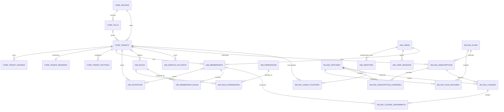
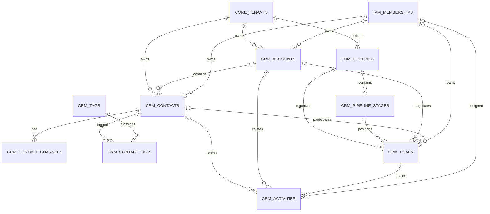
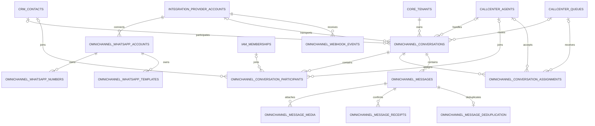
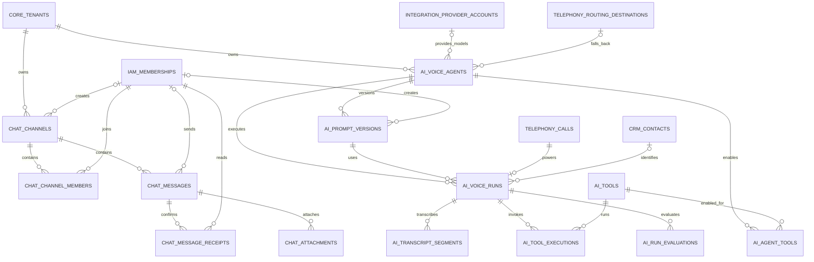
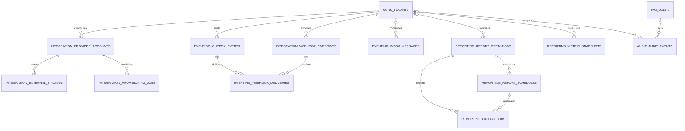

# Modelagem Completa do Banco de Dados

## 1. Escopo

Esta modelagem implementa o banco transacional da plataforma SaaS UCaaS +
CCaaS descrita em `ARQUITETURA_MESTRA.md`.

Artefatos:

- `database/postgresql/schema.sql`: modelo físico completo;
- `database/postgresql/reference_data.sql`: permissões, features e perfis padrão;
- `database/postgresql/health_checks.sql`: consultas operacionais de saúde;
- este documento: modelo lógico, DER, relacionamentos, multi-tenancy,
  auditoria e performance.

Base técnica:

- PostgreSQL 16 ou superior;
- extensões `pgcrypto`, `citext` e `pg_trgm`;
- UUID como identificador público e relacional;
- `timestamptz` em UTC;
- schemas por domínio;
- Row-Level Security;
- particionamento declarativo;
- Transactional Outbox e Idempotent Inbox.

O modelo possui 101 tabelas lógicas, cinco partições default declaradas e
partições hash/mensais criadas pelo próprio script.

## 2. Decisões principais

1. Banco e schema compartilhados entre empresas no início.
2. Toda tabela de negócio possui `tenant_id`.
3. Relações internas ao tenant usam `(tenant_id, id)`.
4. RLS é forçada nas tabelas tenant-scoped.
5. Chamadas, conversas, mensagens e transcrições usam 32 partições hash.
6. Eventos, métricas, estados e auditoria usam partições mensais.
7. Arquivos ficam em S3/MinIO; o PostgreSQL guarda metadados e object keys.
8. Secrets ficam em Vault ou secret manager; o banco guarda `secret_ref`.
9. O FusionPBX não é o banco mestre do SaaS.
10. Alterações externas usam jobs idempotentes e reconciliação.
11. Eventos de negócio usam outbox/inbox.
12. Dados analíticos migram para ClickHouse quando o volume justificar.

## 3. Schemas de domínio

| Schema | Responsabilidade | Tabelas lógicas |
| --- | --- | ---: |
| `core` | regiões, células, empresas e white label | 6 |
| `iam` | identidade, sessão, membership e RBAC | 10 |
| `billing` | planos, features, assinaturas e licenças | 8 |
| `integration` | providers, vínculos externos e provisionamento | 4 |
| `crm` | contas, contatos, pipeline e atividades | 9 |
| `telephony` | configuração e operação de telefonia | 20 |
| `callcenter` | agentes, skills, filas e campanhas | 12 |
| `omnichannel` | WhatsApp, conversas e mensagens | 11 |
| `chat` | chat corporativo | 5 |
| `ai` | agentes e execuções de IA de voz | 8 |
| `reporting` | relatórios, exports e métricas | 4 |
| `eventing` | outbox, inbox e webhooks de saída | 3 |
| `audit` | trilha histórica imutável | 1 |

## 4. Modelo lógico

### 4.1 Plataforma, IAM e billing



### 4.2 CRM



### 4.3 Telefonia e Call Center

```mermaid
erDiagram
    CORE_TENANTS ||--o{ TELEPHONY_EXTENSIONS : owns
    IAM_MEMBERSHIPS o|--o| TELEPHONY_EXTENSIONS : uses
    TELEPHONY_EXTENSIONS ||--o{ TELEPHONY_EXTENSION_DEVICES : registers

    CORE_TENANTS ||--o{ TELEPHONY_SIP_TRUNKS : owns
    INTEGRATION_PROVIDER_ACCOUNTS o|--o{ TELEPHONY_SIP_TRUNKS : provides
    TELEPHONY_ROUTING_DESTINATIONS ||--o{ TELEPHONY_INBOUND_ROUTES : receives
    TELEPHONY_SIP_TRUNKS o|--o{ TELEPHONY_INBOUND_ROUTES : receives
    TELEPHONY_OUTBOUND_ROUTES ||--o{ TELEPHONY_OUTBOUND_ROUTE_PATTERNS : matches
    TELEPHONY_OUTBOUND_ROUTES ||--o{ TELEPHONY_OUTBOUND_ROUTE_TRUNKS : selects
    TELEPHONY_SIP_TRUNKS ||--o{ TELEPHONY_OUTBOUND_ROUTE_TRUNKS : routes

    TELEPHONY_IVRS ||--o{ TELEPHONY_IVR_OPTIONS : contains
    TELEPHONY_ROUTING_DESTINATIONS ||--o{ TELEPHONY_IVR_OPTIONS : directs
    TELEPHONY_RING_GROUPS ||--o{ TELEPHONY_RING_GROUP_MEMBERS : contains
    TELEPHONY_EXTENSIONS ||--o{ TELEPHONY_RING_GROUP_MEMBERS : rings
    TELEPHONY_PICKUP_GROUPS ||--o{ TELEPHONY_PICKUP_GROUP_MEMBERS : contains
    TELEPHONY_EXTENSIONS ||--o{ TELEPHONY_PICKUP_GROUP_MEMBERS : picks_up

    IAM_MEMBERSHIPS ||--o| CALLCENTER_AGENTS : represents
    TELEPHONY_EXTENSIONS o|--o| CALLCENTER_AGENTS : serves
    CALLCENTER_AGENTS ||--o{ CALLCENTER_AGENT_SKILLS : has
    CALLCENTER_SKILLS ||--o{ CALLCENTER_AGENT_SKILLS : classifies
    CALLCENTER_QUEUES ||--o{ CALLCENTER_QUEUE_AGENTS : contains
    CALLCENTER_AGENTS ||--o{ CALLCENTER_QUEUE_AGENTS : attends
    CALLCENTER_QUEUES ||--o{ CALLCENTER_QUEUE_SKILLS : requires
    CALLCENTER_SKILLS ||--o{ CALLCENTER_QUEUE_SKILLS : required
    CALLCENTER_BUSINESS_HOURS ||--o{ CALLCENTER_QUEUE_SCHEDULES : governs
    CALLCENTER_QUEUES ||--o| CALLCENTER_QUEUE_SCHEDULES : follows
    CALLCENTER_AGENTS ||--o{ CALLCENTER_AGENT_STATE_HISTORY : changes

    CALLCENTER_QUEUES o|--o{ CALLCENTER_CAMPAIGNS : executes
    TELEPHONY_OUTBOUND_ROUTES o|--o{ CALLCENTER_CAMPAIGNS : routes
    CALLCENTER_CAMPAIGNS ||--o{ CALLCENTER_CAMPAIGN_CONTACTS : targets
    CRM_CONTACTS ||--o{ CALLCENTER_CAMPAIGN_CONTACTS : contacted

    TELEPHONY_CALLS ||--o{ TELEPHONY_CALL_LEGS : contains
    TELEPHONY_CALLS ||--o{ TELEPHONY_CALL_EVENTS : emits
    TELEPHONY_CALL_LEGS o|--o{ TELEPHONY_CALL_EVENTS : emits
    TELEPHONY_CALLS ||--o{ TELEPHONY_RECORDINGS : records
    TELEPHONY_CALL_LEGS o|--o{ TELEPHONY_RECORDINGS : records
    TELEPHONY_EXTENSIONS ||--o{ TELEPHONY_VOICEMAIL_MESSAGES : receives
    TELEPHONY_CALLS o|--o{ TELEPHONY_VOICEMAIL_MESSAGES : leaves

    CRM_CONTACTS o|--o{ TELEPHONY_CALLS : identifies
    CALLCENTER_QUEUES o|--o{ TELEPHONY_CALLS : queues
    CALLCENTER_CAMPAIGNS o|--o{ TELEPHONY_CALLS : originates
    CALLCENTER_QUEUES ||--o{ CALLCENTER_QUEUE_INTERACTIONS : tracks
    CALLCENTER_AGENTS o|--o{ CALLCENTER_QUEUE_INTERACTIONS : handles
    TELEPHONY_CALLS o|--o{ CALLCENTER_QUEUE_INTERACTIONS : represents
```



### 4.4 WhatsApp e Omnichannel



### 4.5 Chat e IA de Voz



### 4.6 Integração, eventos, relatórios e auditoria



## 5. Catálogo de tabelas

### 5.1 `core`

| Tabela | Finalidade |
| --- | --- |
| `regions` | Região de infraestrutura e residência de dados |
| `cells` | Célula operacional de comunicação |
| `tenants` | Empresa cliente e placement |
| `tenant_domains` | Subdomínios e domínios white label |
| `tenant_branding` | Identidade visual e comunicação |
| `tenant_settings` | Configurações extensíveis por chave |

### 5.2 `iam`

| Tabela | Finalidade |
| --- | --- |
| `users` | Identidade humana global |
| `identities` | Vínculos OIDC/SAML/IdP |
| `user_sessions` | Sessões e famílias de refresh token |
| `memberships` | Vínculo usuário-tenant |
| `invitations` | Convites de acesso |
| `permissions` | Catálogo global de capacidades |
| `roles` | Perfis globais ou do tenant |
| `role_permissions` | Permissões concedidas ao perfil |
| `membership_roles` | Perfis atribuídos ao membership |
| `service_accounts` | Credenciais de integração máquina a máquina |

### 5.3 `billing`

| Tabela | Finalidade |
| --- | --- |
| `plans` | Versões dos planos comerciais |
| `features` | Recursos mensuráveis/licenciáveis |
| `plan_features` | Limites e preço excedente por plano |
| `subscriptions` | Assinatura vigente do tenant |
| `subscription_overrides` | Exceções comerciais temporárias |
| `licenses` | Quantidade contratada por recurso |
| `license_assignments` | Consumo nominal ou por recurso |
| `usage_counters` | Uso agregado por período |

### 5.4 `integration`

| Tabela | Finalidade |
| --- | --- |
| `provider_accounts` | Conta lógica de provider e `secret_ref` |
| `external_bindings` | Mapeamento SaaS para ID externo |
| `provisioning_jobs` | Comandos idempotentes de provisionamento |
| `webhook_endpoints` | Webhooks de saída do tenant |

### 5.5 `crm`

| Tabela | Finalidade |
| --- | --- |
| `accounts` | Empresas ou organizações do CRM |
| `contacts` | Pessoas e contatos |
| `contact_channels` | Telefone, WhatsApp, e-mail e outros canais |
| `tags` | Classificações |
| `contact_tags` | Associação contato-tag |
| `pipelines` | Funis comerciais |
| `pipeline_stages` | Etapas do funil |
| `deals` | Oportunidades |
| `activities` | Tarefas, ligações, reuniões e notas |

### 5.6 `telephony`

| Tabela | Finalidade |
| --- | --- |
| `extensions` | Ramais e políticas |
| `extension_devices` | Webphones, softphones e telefones físicos |
| `sip_trunks` | Troncos e limites |
| `routing_destinations` | Destino abstrato para dialplan |
| `inbound_routes` | Rotas de entrada |
| `outbound_routes` | Rotas de saída |
| `outbound_route_patterns` | Regras de discagem |
| `outbound_route_trunks` | Ordem/failover de troncos |
| `ivrs` | URAs |
| `ivr_options` | Opções DTMF |
| `ring_groups` | Grupos de toque |
| `ring_group_members` | Ramais do grupo |
| `pickup_groups` | Grupos de captura |
| `pickup_group_members` | Ramais do grupo de captura |
| `calls` | CDR canônico e estado final da chamada |
| `call_legs` | Pernas SIP da chamada |
| `event_deduplication` | Deduplicação de eventos FreeSWITCH |
| `call_events` | Timeline bruta/normalizada |
| `recordings` | Metadados de gravações em object storage |
| `voicemail_messages` | Correio de voz |

### 5.7 `callcenter`

| Tabela | Finalidade |
| --- | --- |
| `skills` | Competências de atendimento |
| `agents` | Agentes e capacidade simultânea |
| `agent_skills` | Proficiência por skill |
| `queues` | Filas de voz/digital |
| `queue_agents` | Agentes membros da fila |
| `queue_skills` | Skills exigidas |
| `business_hours` | Calendário semanal e feriados |
| `queue_schedules` | Horário e destino fechado |
| `agent_state_history` | Histórico de presença e pausas |
| `campaigns` | Campanhas de discagem |
| `campaign_contacts` | Alvos, tentativas e disposições |
| `queue_interactions` | Métricas de cada atendimento |

### 5.8 `omnichannel`

| Tabela | Finalidade |
| --- | --- |
| `whatsapp_accounts` | WABA/BSP |
| `whatsapp_numbers` | Números conectados |
| `whatsapp_templates` | Templates e aprovação |
| `conversations` | Conversa canônica multicanal |
| `conversation_participants` | Contatos, agentes, usuários e bots |
| `conversation_assignments` | Histórico de distribuição |
| `message_deduplication` | Idempotência por ID do provider |
| `messages` | Mensagens normalizadas |
| `message_media` | Anexos em object storage |
| `message_receipts` | Sent, delivered, read e failed |
| `webhook_events` | Payloads recebidos e processamento |

### 5.9 `chat`

| Tabela | Finalidade |
| --- | --- |
| `channels` | Canal direto, grupo, equipe ou anúncio |
| `channel_members` | Participantes e leitura |
| `messages` | Mensagens ordenadas por canal |
| `message_receipts` | Entrega e leitura |
| `attachments` | Arquivos em object storage |

### 5.10 `ai`

| Tabela | Finalidade |
| --- | --- |
| `voice_agents` | Configuração publicável do agente |
| `prompt_versions` | Prompts imutáveis e versionados |
| `tools` | Ferramentas permitidas |
| `agent_tools` | Allowlist de ferramentas |
| `voice_runs` | Execução ligada a uma chamada |
| `transcript_segments` | Transcrição temporal por speaker |
| `tool_executions` | Auditoria das ações do agente |
| `run_evaluations` | Avaliação humana ou automática |

### 5.11 `reporting`, `eventing` e `audit`

| Tabela | Finalidade |
| --- | --- |
| `report_definitions` | Relatórios permitidos |
| `report_schedules` | Agendamento e destinatários |
| `export_jobs` | Exportações assíncronas |
| `metric_snapshots` | Séries temporais agregadas |
| `outbox_events` | Eventos pendentes de publicação |
| `inbox_messages` | Deduplicação por consumidor |
| `webhook_deliveries` | Entrega e retry de webhooks |
| `audit_events` | Trilha de alterações e acessos |

## 6. Modelo físico

### 6.1 Identificadores

- `id`: UUID interno.
- `public_id`: UUID separado quando a entidade é exposta diretamente.
- Nenhum identificador sequencial é enviado ao cliente.
- O schema usa `gen_random_uuid()` por compatibilidade com PostgreSQL 16.
- UUIDv7 pode substituir o default futuramente, sem alterar os contratos.

### 6.2 Datas

- `timestamptz` para instantes.
- Aplicação e banco persistem UTC.
- Timezone do tenant é usada somente na apresentação e agregação.
- `created_at` é imutável.
- `updated_at` é mantido por trigger.
- Soft delete usa `deleted_at` nas entidades relevantes.

### 6.3 Valores e conteúdo

- Dinheiro: `numeric`, nunca `float`.
- Moeda: ISO 4217 em `char(3)`.
- Telefones: E.164 normalizado.
- E-mails e hostnames: `citext`.
- Endereços IP: `inet`.
- MAC: `macaddr`.
- Checksums: SHA-256 hexadecimal.
- Configuração flexível: `jsonb` com constraint de tipo.
- Segredos: somente `secret_ref` ou hash irreversível.

### 6.4 Integridade tenant-aware

Cada entidade referenciável do tenant possui:

```sql
UNIQUE (tenant_id, id)
```

Filhos usam:

```sql
FOREIGN KEY (tenant_id, parent_id)
REFERENCES domain.parent (tenant_id, id)
```

Assim, mesmo uma query com bug não consegue associar um ramal do tenant A a
uma fila do tenant B.

### 6.5 Polimorfismo controlado

Os poucos relacionamentos polimórficos são explícitos:

- `telephony.routing_destinations`;
- `integration.external_bindings`;
- targets de licenças;
- recursos associados a roles.

Campos polimórficos têm `resource_type`, `resource_id` e constraints de
presença. A aplicação valida que o tipo corresponde a um recurso autorizado.

## 7. Multi-Tenant

### 7.1 Contexto da transação

Cada request autenticado deve abrir uma transação e definir o contexto:

```sql
BEGIN;

SELECT core.set_request_context(
    'tenant-uuid',
    'user-uuid',
    'membership-uuid',
    'correlation-id'
);

SELECT *
FROM telephony.extensions
WHERE status = 'active';

COMMIT;
```

`set_config(..., true)` torna as variáveis locais à transação. Isso é
compatível com PgBouncer em transaction pooling e evita vazamento de contexto
entre conexões reutilizadas.

### 7.2 RLS

A policy padrão é:

```sql
USING (tenant_id = core.current_tenant_id())
WITH CHECK (tenant_id = core.current_tenant_id())
```

O script executa:

```sql
ENABLE ROW LEVEL SECURITY
FORCE ROW LEVEL SECURITY
```

Exceções:

- `tenant_domains` e `tenant_branding` são consultadas pelo resolver de host;
- acesso público ocorre somente pela view `core.public_tenant_branding`;
- `audit_events` mantém RLS habilitada, mas sem `FORCE`, permitindo que a
  função `SECURITY DEFINER` do trigger grave evidências;
- permissões diretas às tabelas devem ser revogadas dos roles de runtime;
- serviços globais usam credencial de banco separada e auditada.

`memberships` permite que o usuário liste seus próprios vínculos antes de
selecionar o tenant. `user_sessions` permite acesso às próprias sessões.

### 7.3 Roles de banco recomendados

| Role | Uso |
| --- | --- |
| Migration owner | DDL; não utilizado em runtime |
| Tenant API | Operações comuns sujeitas a RLS |
| Identity resolver | Login, domínio e membership |
| Platform service | Gestão global; acesso privilegiado auditado |
| Worker | Outbox, inbox, jobs e integrações |
| Reporting reader | Réplica de leitura e views aprovadas |
| Support JIT | Acesso temporário, com ticket e auditoria |

O usuário proprietário das tabelas não deve ser o usuário normal da API.
Roles de runtime recebem grants nos pais particionados, nunca grants globais em
todas as partições filhas; acesso direto a uma partição poderia contornar a
policy definida no pai.

### 7.4 Teste obrigatório de isolamento

Para cada endpoint e repository:

1. criar tenant A e tenant B;
2. definir contexto A;
3. tentar ler e alterar ID do tenant B;
4. esperar zero linhas ou violação de policy;
5. repetir em jobs, exports e WebSockets;
6. executar teste após toda migration.

## 8. Auditoria

### 8.1 Auditoria automática

O trigger `audit.capture_row_change()` registra:

- INSERT, UPDATE e DELETE;
- tenant;
- usuário e membership;
- tabela e registro;
- valores anteriores e posteriores;
- campos alterados;
- correlation ID;
- resultado.

Ele é aplicado seletivamente a:

- tenant e white label;
- memberships e RBAC;
- assinatura e licenças;
- providers e external bindings;
- CRM;
- configuração de telefonia;
- filas, agentes e campanhas;
- WhatsApp;
- IA de voz;
- agendamentos.

Mensagens, eventos e métricas não recebem trigger linha a linha, pois isso
duplicaria volume. Esses fluxos geram eventos de domínio ou auditoria de acesso.

### 8.2 Redação

`audit.redact_sensitive()` remove campos comuns de segredo antes de armazenar
`old_data` e `new_data`.

Conteúdo de mensagens, áudio, transcrições completas, hashes de sessão e
credenciais não devem ser copiados para auditoria genérica.

### 8.3 Imutabilidade

- `audit_events` não possui FK para usuários ou tenants.
- Exclusões não removem evidências históricas.
- Role de runtime recebe INSERT quando necessário, nunca UPDATE/DELETE.
- Partições encerradas podem ser exportadas para storage WORM.
- Acesso a gravação e transcrição deve gerar evento explícito.

## 9. Particionamento

### 9.1 Hash por tenant

32 partições:

- `telephony.calls`;
- `omnichannel.conversations`;
- `omnichannel.messages`;
- `chat.channels`;
- `chat.messages`;
- `ai.voice_runs`;
- `ai.transcript_segments`.

Benefícios:

- índices menores;
- distribuição de escrita;
- manutenção paralela;
- PK e FK continuam usando `(tenant_id, id)`;
- evita uma partição por empresa.

Uma partição por tenant não é recomendada para 1.000 empresas porque aumenta
catálogo, planning time e custo operacional.

### 9.2 Range mensal

- `telephony.call_events`;
- `callcenter.agent_state_history`;
- `omnichannel.webhook_events`;
- `reporting.metric_snapshots`;
- `audit.audit_events`.

O script cria o mês anterior, o atual e doze meses futuros, além de uma
partição default.

Manutenção mensal:

```sql
CALL core.ensure_monthly_partitions(
    'telephony.call_events',
    'telephony',
    'call_events_y',
    date_trunc('month', current_date)::date,
    15
);
```

A partição do próximo mês deve ser criada antes de receber dados. A partição
default precisa ser monitorada; antes de criar uma partição sobre intervalo que
já contém linhas no default, essas linhas devem ser movidas.

### 9.3 Retenção

| Dado | Online sugerido | Destino posterior |
| --- | ---: | --- |
| Eventos brutos de chamada | 3-6 meses | object storage |
| CDR canônico | 24 meses | ClickHouse/arquivo |
| Webhooks brutos | 30-90 dias | arquivo ou exclusão |
| Mensagens | política contratual | archive tier |
| Auditoria | 5 anos ou política | WORM |
| Métricas agregadas | 24-36 meses | ClickHouse |
| Gravações | plano/LGPD | lifecycle S3 |
| Transcrições | política/LGPD | criptografado ou exclusão |

Eliminar uma partição é preferível a executar `DELETE` em milhões de linhas.

## 10. Índices

### 10.1 Regras aplicadas

- B-tree começa por `tenant_id` nas consultas do tenant.
- Índices parciais cobrem estados ativos e filas pendentes.
- BRIN cobre séries temporais append-only.
- GIN trigram cobre nomes.
- GIN `to_tsvector` cobre busca inicial em mensagens.
- Constraints únicas implementam idempotência.
- Índices de FK existem nos caminhos de alto uso.

Exemplos:

```sql
(tenant_id, started_at DESC)
(tenant_id, status, started_at DESC)
(tenant_id, conversation_id, created_at, id)
(tenant_id, queue_id, status, priority, waiting_since)
```

### 10.2 Paginação

Não usar `OFFSET` profundo.

Chamadas:

```sql
WHERE tenant_id = $1
  AND (started_at, id) < ($2, $3)
ORDER BY started_at DESC, id DESC
LIMIT 100;
```

Mensagens:

```sql
WHERE tenant_id = $1
  AND conversation_id = $2
  AND (created_at, id) > ($3, $4)
ORDER BY created_at, id
LIMIT 100;
```

## 11. Estratégia para milhões de registros

### 11.1 Chamadas

- `calls` guarda o CDR normalizado.
- `call_legs` guarda topologia da chamada.
- `call_events` guarda eventos detalhados e é particionada por mês.
- Payload bruto deve ser reduzido ao necessário.
- Relatórios históricos leem réplica ou ClickHouse.
- Gravações nunca ficam em bytea.

### 11.2 Mensagens

- `conversations` mantém estado corrente.
- `messages` é append-mostly e hash-partitioned.
- `message_deduplication` garante idempotência.
- Mídia é armazenada fora do banco.
- Receipts ficam separados para evitar regravar payload grande.
- Pesquisa de grande escala migra para OpenSearch.

### 11.3 Auditoria

- auditoria mensal;
- trigger apenas em entidades de configuração;
- eventos de acesso são inseridos explicitamente;
- partições antigas são read-only;
- exportação WORM para compliance.

### 11.4 Relatórios

- exports são jobs assíncronos;
- consultas operacionais usam read models;
- métricas são pré-agregadas em `metric_snapshots`;
- réplica de leitura recebe relatórios;
- CDC/outbox alimenta ClickHouse;
- nenhuma consulta de dashboard faz full scan de evento bruto.

### 11.5 Vacuum e estatísticas

Para tabelas quentes:

- autovacuum com thresholds menores;
- `ANALYZE` após carga ou criação de partição;
- `fillfactor` menor em tabelas com muitos updates;
- monitorar dead tuples e idade de transaction ID;
- `REINDEX CONCURRENTLY` quando necessário;
- evitar transações longas;
- usar `CREATE INDEX CONCURRENTLY` nas migrations online.

Parâmetros precisam ser calibrados por memória, IOPS e workload, não copiados
como valores universais.

### 11.6 Conexões

- PgBouncer em transaction pooling;
- pool pequeno por pod;
- limite global abaixo de `max_connections`;
- timeout de statement por classe de serviço;
- timeout de lock;
- cancelamento de relatórios caros;
- workers usam `FOR UPDATE SKIP LOCKED`.

Exemplo para claim de job:

```sql
SELECT id
FROM integration.provisioning_jobs
WHERE status IN ('pending', 'failed')
  AND scheduled_at <= now()
ORDER BY priority, scheduled_at
FOR UPDATE SKIP LOCKED
LIMIT 50;
```

## 12. Constraints críticas

| Regra | Implementação |
| --- | --- |
| Um ramal por número no tenant | `UNIQUE (tenant_id, extension_number)` |
| Um canal normalizado por tenant | unique em `contact_channels` |
| Um membership por usuário/tenant | unique em `memberships` |
| Um owner ativo por tenant | índice único parcial |
| Uma assinatura corrente | índice único parcial |
| Uma atribuição ativa por conversa | índice único parcial |
| Mensagem externa idempotente | PK em `message_deduplication` |
| Job idempotente | unique em `provisioning_jobs` |
| Ordem de mensagem de chat | unique por canal e sequence |
| Stage pertence ao pipeline | FK composta |
| Filho pertence ao mesmo tenant | FK `(tenant_id, id)` |
| Datas não regressivas | checks de timeline |
| Valores e quantidades válidos | checks numéricos |
| JSON esperado | `jsonb_typeof` |

## 13. Outbox, Inbox e concorrência

### 13.1 Outbox

Na mesma transação:

```sql
INSERT INTO telephony.extensions (...);
INSERT INTO eventing.outbox_events (...);
COMMIT;
```

Publisher:

1. seleciona eventos não publicados;
2. usa `FOR UPDATE SKIP LOCKED`;
3. publica no NATS;
4. marca `published_at`;
5. incrementa tentativa em falha.

### 13.2 Inbox

Cada consumidor persiste:

```text
consumer_name + message_id
```

A PK impede processamento duplicado. O efeito e a marcação como processado
devem ocorrer na mesma transação.

### 13.3 Locks

- Não usar advisory locks globais por tenant sem TTL operacional.
- Atualização de quota usa row lock curto.
- Sequência do chat deve ser alocada atomicamente.
- Provisionamento usa `idempotency_key`.
- Webhooks usam deduplicação antes de efeitos colaterais.

## 14. Segurança dos dados

- TLS obrigatório.
- Criptografia do volume e backups.
- Secret manager externo.
- Object storage com SSE-KMS.
- URLs assinadas de curta duração.
- `search_path` fixo em funções `SECURITY DEFINER`.
- Nenhum SQL montado com input sem identifier quoting.
- Role de migration separada.
- Restore testado.
- PITR habilitado.
- Logs sem conteúdo sensível.
- Rotação de credenciais.
- DDL em migrations revisadas.

## 15. Fluxo de migrations

Ordem inicial:

```text
1. database/postgresql/schema.sql
2. database/postgresql/reference_data.sql
3. grants específicos do ambiente
4. seed de região, célula e planos comerciais
```

Para criar os perfis de um tenant:

```sql
BEGIN;

SELECT core.set_request_context(
    'tenant-uuid',
    'platform-user-uuid',
    NULL,
    'tenant-bootstrap'
);

SELECT iam.bootstrap_tenant_roles('tenant-uuid');

COMMIT;
```

Migrations futuras seguem expand/contract:

1. adicionar coluna/tabela compatível;
2. publicar aplicação que escreve nos dois formatos;
3. executar backfill em lotes;
4. trocar leitura;
5. adicionar constraint `NOT VALID`;
6. validar constraint;
7. remover formato antigo em release posterior.

## 16. Validação e testes

Suite mínima:

- aplicar schema em PostgreSQL 16 limpo;
- reaplicar `reference_data.sql`;
- testar todas as FKs;
- testar RLS entre dois tenants;
- testar membership multiempresa;
- testar deduplicação;
- testar insert em todas as partições;
- testar virada de mês;
- testar partição default;
- testar cascade e soft delete;
- testar audit redaction;
- testar restore;
- executar `EXPLAIN (ANALYZE, BUFFERS)` nas consultas críticas;
- carga com volume equivalente a 1.000 tenants.

Na estação em que o documento foi criado não havia binário `psql` nem Docker.
O SQL recebeu validação estrutural e estática, mas deve obrigatoriamente ser
executado em PostgreSQL 16 de staging antes de virar migration de produção.

## 17. Arquivos de referência

- Arquitetura: `docs/ARQUITETURA_MESTRA.md`
- Schema: `database/postgresql/schema.sql`
- Dados base: `database/postgresql/reference_data.sql`
- Saúde operacional: `database/postgresql/health_checks.sql`
- PostgreSQL Row Security:
  https://www.postgresql.org/docs/current/ddl-rowsecurity.html
- PostgreSQL Partitioning:
  https://www.postgresql.org/docs/current/ddl-partitioning.html
- PostgreSQL CREATE TABLE:
  https://www.postgresql.org/docs/current/sql-createtable.html
